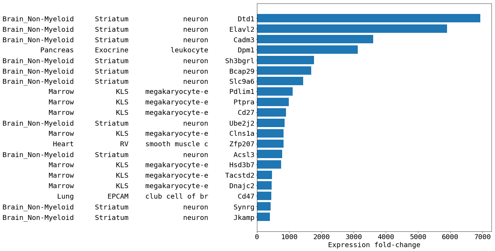

# Exploration of the Mus Musculus aging dynamics
On the [Tabula Muris Senis](https://github.com/czbiohub/tabula-muris-senis) dataset.  
Data is raw RNA-seq counts from
```
https://czb-tabula-muris-senis.s3-us-west-2.amazonaws.com/Data-objects/tabula-muris-senis-facs-official-raw-obj.h5ad
```

<!-- Gene annotations are from
```
ftp://ftp.ncbi.nih.gov/gene/DATA/GENE_INFO/Mammalia/Mus_musculus.gene_info.gz
``` -->

**Pre-processed** as  
- RNA counts normalized to 1.0 per cell

Cell **statistics** (expression mean and std.dev) are calculated - with 4 levels of granularity - on subsets defined by a unique combination of  
- Animal sex
- Tissue type
- Subtissue type
- Cell type

Expression **fold-changes** computed between subsets of the pairs of age groups are filtered as  
- Subset has >= 3 cells
<!-- - Mean expression values are >= 4 max(std. dev) apart -->
- Expression is >= 1e-12 in both age groups
- Bonferroni correction is applied to p-values by multiplying them first by the number of genes (~20k) and then by the number of subsets (2-1000 depending on granularity). Results are then thresholded by 1e-5

<!-- Here're the largest 20 fold-changes.  
Columns are: tissue, subtissue, cell type, gene
 -->

All the results for different analysis granularity levels:
- [results/merged-cell_ontology_class.csv](./results/merged-cell_ontology_class.csv)  
- [results/merged-subtissue.csv](./results/merged-subtissue.csv)  
- [results/merged-tissue.csv](./results/merged-tissue.csv)  
- [results/merged-sex.csv](./results/merged-sex.csv)  
<!-- All of them are marked as _low_ confidence as the expression means were only between 4 to 5 max(std. dev) apart -->
